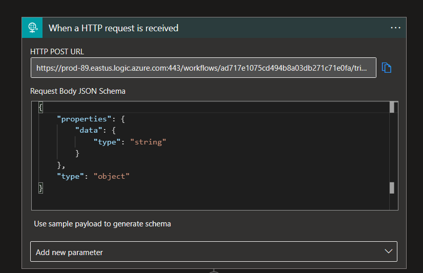
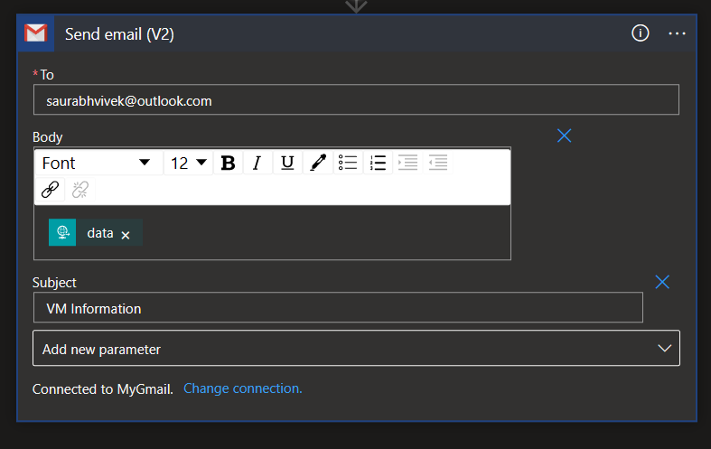

# Description

The Azure function will run Resource Graph query and saves the result in Storage Account Posts the same data to a Logic App.

# SetUp

## Script setup
You would need to edit the [script](./ReportVMStatus/run.ps1?plain=1#L4) with resource graph query and the storage account info.

## Permission Setup
You need to enable Managed identity on Azure Function and provide `Reader` access to the Manged Identity on Subscription and `Contributor` access on storage account.

## Logic App Setup

1. Create a Logic app with HTTP Post trigger and Sample Payload as follow, using steps mentioned in the section [here](https://learn.microsoft.com/en-us/azure/app-service/tutorial-send-email?tabs=dotnet#create-the-logic-app).
    ```
    {
        "data": ""
    }
    ```
    Trigger should look like follow 
    
     
2. The above documentation has mail recipient, subject and body all as part of the trigger. As we just getting the body(as data), you need to hardcode other two in send mail action.
   Action should look like follow
   

3. Save the HTTP Post URL as `LOGIC_APP_URL` in Application setting of Function App.